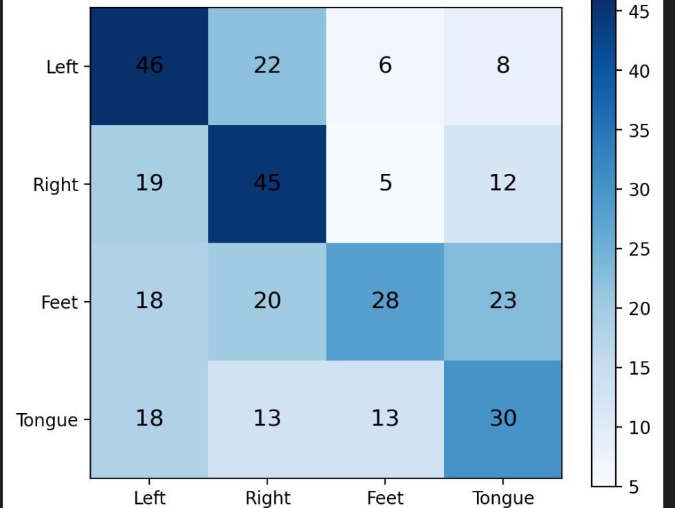
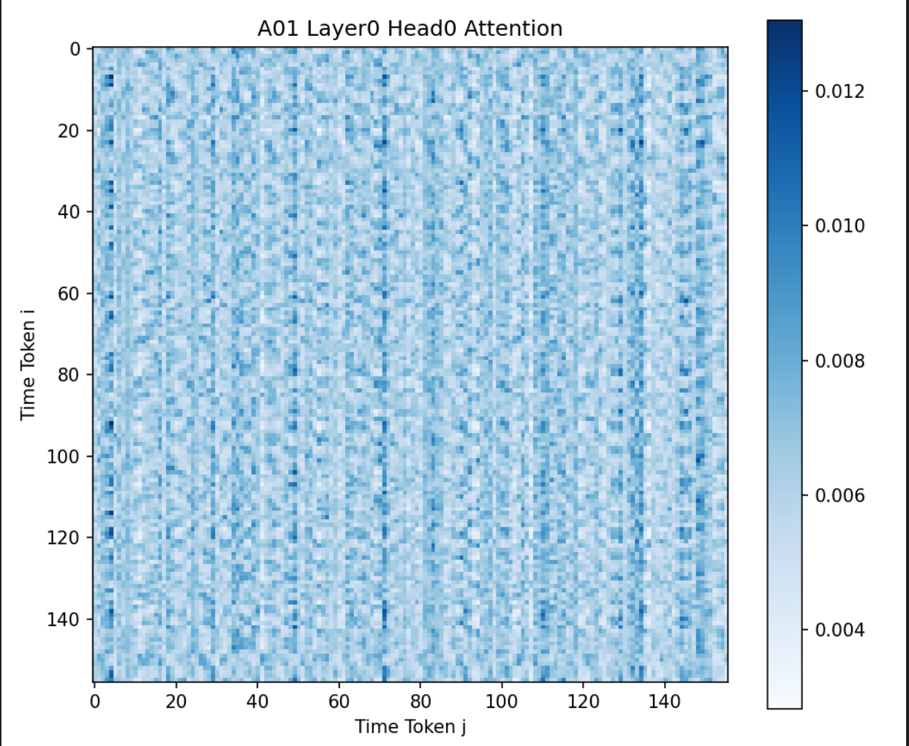

# EEGConformer 运动想象分类实验报告

## 1. 任务说明

本实验复现 EEGConformer，对运动想象脑电信号进行 4 分类。

```text
输入：(22, T) 的多通道脑电时间序列（BCI Competition IV 2a, 22 通道, 250 Hz）
输出：4 类运动想象类别（左手 / 右手 / 双脚 / 舌头）
评估指标：测试集 classification accuracy + Cohen's Kappa + 混淆矩阵
```

**核心学习目标**：深入理解 Transformer 的 Self-Attention 机制，以及 CNN + Transformer（Conformer）协同工作的原理。

## 2. 数据集

- 数据集名称：BCI Competition IV 2a
- 范式：运动想象（Motor Imagery），4 分类
- 通道数：22
- 采样率：250 Hz
- 被试数：9 人
- 每被试训练集 trial 数：288
- 每被试测试集 trial 数：288
- 总训练耗时：3min 49s
- 使用设备： GPU

### 被试与类别信息

| 类别 | 标签 | 含义 |
|---|---|---|
| 0 | left_hand | 左手运动想象 |
| 1 | right_hand | 右手运动想象 |
| 2 | feet | 双脚运动想象 |
| 3 | tongue | 舌头运动想象 |

请说明你选用的实验设置（被试内 / 跨被试），并给出训练集、验证集、测试集的划分方式。

```text
被试内
划分比例 Train:Val:Test = 70% : 15% : 15%
```


## 3. 数据预处理

| 步骤 | 预处理操作 | 参数设置                           |
|---|---|--------------------------------|---|
| 1 | 重参考（Re-referencing） | 参考方式：                          | CAR（公共平均参考）|
| 2 | 带通滤波（Bandpass Filtering） | 高通= 30Hz, 低通= 4Hz, 滤波器类型=  FIR | |
| 3 | 陷波滤波（Notch Filtering） | 频率=50 Hz（国内 50 Hz）              | |
| 4 | 坏导处理（Bad Channel） | 检测方法/处理方式：   未执行自动坏通道检测，固定选取前 22 个 EEG 通道；无通道剔除操作                  | |
| 5 | 伪迹去除（Artifact Removal） | 方法（ICA/AutoReject/阈值拒绝/无）：阈值拒绝     | |
| 6 | 分段（Epoching） | tmin= -0.5 s, tmax= 2.5 s, 时间点数 T= 750（原始 epoch）；裁剪后有效区间 T=626  | |
| 7 | 基线校正（Baseline Correction） | 基线窗口：[-0.5, 0.0] s                          | |
| 8 | 归一化/标准化 | 方式= Z-score 标准化, 统计量来源：仅训练集         | |
| 9 | 验证集划分 | 划分比例=训练集：验证集：测试集 = 70%:15%:15%,, 划分方式（随机/按被试）：时序顺序划分           | |

如有其他，可自行补充，并请说明为什么选择这些预处理方式，它们对后续 CNN 和 Transformer 各有什么影响：

```text
（在这里填写）
```

## 4. 模型结构

### 4.1 整体架构图

画出你的 EEGConformer 完整结构，标注每层的输入输出维度：

```text
e.g.

Input: (batch, 1, C=22, T=626)
  │
  ▼
[CNN Stem]
  │   Temporal Conv2d (1 -> F1=8, kernel=(1, 32))
  │   BatchNorm2d
  │   Spatial Conv2d (F1=8 -> D=2, kernel=(22, 1), groups=8)   ← Depthwise
  │   BatchNorm2d + ELU
  │   AvgPool2d (kernel=(1, 4))
  │   Dropout(0.1)
  │   Output: (batch, 16, 1, T'=156)   -> reshape to (batch, T'=156, 16)
  │
  ▼
[Projection]: Linear(D*F1=16, d_model=128)
  │   Output: (batch, T'=156, d_model=128)
  │
  ▼
[Position Encoding]: Learnable (1, max_len=1000, d_model=128)
  │   Output: (batch, T'=156, d_model=128)
  │
  ▼
[Transformer Encoder × N=4]
  │   ┌─────────────────────────────────────┐
  │   │  Pre-LN（代码默认use_pre_ln=True）   │
  │   │  Multi-Head Self-Attention (h=8 heads)│
  │   │  Residual Connection                  │
  │   │  LayerNorm                            │
  │   │  FFN (d_model=128 -> d_ff=256 -> d_model=128)  │
  │   │  GELU + Dropout(0.1)                       │
  │   │  Residual Connection                  │
  │   │  LayerNorm                            │
  │   └─────────────────────────────────────┘
  │   Output: (batch, T'=156, d_model=128)
  │
  ▼
[Classification Head]
  │   LayerNorm(d_model=128) -> Global Avg Pool (over T'=156) -> Linear(128, num_classes=4)
  │
  ▼
Output: (batch, 4)
```

### 4.2 关键维度参数

| 参数 | 符号 | 你的取值 |
|---|---|------|
| 时间卷积输出通道数 | F1 | 8    |
| 空间卷积输出通道数 | D | 2    |
| Transformer embedding 维度 | d_model | 128  |
| 注意力头数 | h | 8    |
| FFN 中间层维度 | d_ff | 256  |
| Transformer 层数 | N | 4    |
| Dropout 概率 | p | 0.1  |
| 模型总参数量 | — |   661.52 K   |
| ... | — |      |

### 4.3 各组件作用说明

#### CNN 部分

| 组件 | 在 EEGConformer 中的作用 |
|---|---|
| Temporal Conv2d | 沿时间轴卷积，提取每个通道的局部时域特征（如 μ、β 节律） |
| Spatial Conv2d (Depthwise) | 跨通道卷积，学习空间滤波器组合，提取不同脑区的激活模式 |
| AvgPool2d | 在时间维度上下采样，减小后续 Transformer 的序列长度 |
| ... | |

#### Transformer 部分

| 组件 | 作用 | 你的理解 |
|---|---|---|
| Position Encoding | 为 token 序列注入位置/时序信息，因为 Self-Attention 本身对位置不敏感 | |
| Multi-Head Self-Attention | 让每个 token 关注序列中所有其他 token，多个头并行捕捉不同的依赖模式 | |
| Scaled Dot-Product | Q 与 K 的点积除以 √d_k 做缩放，防止维度过大导致 softmax 进入饱和区 | |
| Feed-Forward Network | 对每个 token 独立做非线性变换，增强模型的表达能力 | |
| Residual Connection | 让梯度可以直接流过子层，缓解深层网络的梯度消失问题 | |
| LayerNorm | 对每个样本的特征维度做归一化，稳定训练过程 | |
| GELU 激活 | Transformer 中常用的平滑激活函数 | |
| ... | — | |

#### 分类头

| 组件 | 作用 |
|---|---|
| Global Avg Pooling | 将所有时间步的 token 取平均，得到一个固定长度的向量 |
| Linear | 将 pooling 后的向量映射到 4 个类别的 logits |
| ... | |

### 4.4 尝试解答以下关于 Transformer 的问题

请在报告中逐一回答（不需要长篇大论，说清楚即可）：

1. **Self-Attention 中的 Q、K、V 分别来自哪里？** 它们的物理含义是什么？
Q ：token 序列 X与特征向量Q相乘,当前时刻脑电特征，用来检索相关时序；
K ：token 序列 X与特征向量K相乘，所有时刻脑电特征，用于匹配相似度；
V ：token 序列 X与特征向量V相乘，各时刻原始有效脑电特征，最后加权融合用
2. **为什么要做 Multi-Head？** 如果只用单头（h=1）会怎样？ 
将特征拆分为多组独立子空间，分头各自计算自注意力，能同时捕捉多种不同类型时序关联（短时节律、长时运动依赖、电极空间联动），最后拼接融合，特征表达更丰富。
仅单一特征子空间，只能学到一种时序关联模式，表征能力弱； 容易欠拟合，左右手 / 手脚混淆更严重，分类精度下降； 对微弱的双脚、舌头运动想象特征提取不足。
3. **Scaled Dot-Product 中除以 √d_k 是做什么的？** 不除会有什么问题？
缩放内积，控制数值范围，稳定梯度，
内积数值极大，送入 softmax 后输出趋近 one-hot，分布极端尖锐，梯度极小，训练收敛困难、精度下降。
4. **Position Encoding 是必需的吗？** 如果去掉位置编码，模型在 EEG 数据上会怎样？
必要
分不清早期基线、运动想象激活段、后期静息段； 无法学习运动节律随时间变化的依赖；左右手、双脚、舌头混淆加剧，分类准确率明显下跌。
5. **残差连接和 LayerNorm 各自解决什么问题？** 如果去掉会有什么后果？
残差连接
作用：缓解深层网络梯度消失，让浅层信息直接传递到后端。
去掉后果：4 层 Transformer 堆叠后梯度极易消失，模型难以收敛，精度大幅下滑。 
LayerNorm
作用：标准化每层输入，稳定分布、加速训练、降低梯度震荡。
去掉后果：特征数值波动大，训练不稳定，收敛变慢，分类效果变差。
6. **为什么 EEGConformer 要把 CNN 放在 Transformer 前面？** 直接对原始 EEG 做 Attention 可以吗？
将 CNN 置于 Transformer 前端，是利用卷积先提取脑电局部时空节律特征、压缩数据维度并过滤噪声，降低后续自注意力的计算负担；
能直接对原始脑电输入注意力，但原始信号维度高、噪声干扰强，会造成算力开销巨大且难以提取有效运动想象特征，模型识别效果会明显变差

```text
（在这里逐一回答）
```

## 5. 训练设置

| 配置 |                                 数值 |
|---|-----------------------------------:|
| epochs |                                100 |
| batch size |                                 32 |
| optimizer |                               Adam |
| learning rate | CNN 骨干 3e-5，Transformer / 分类头 8e-5 |
| weight decay |                               1e-4 |
| LR scheduler |        CosineAnnealingWarmRestarts 
| loss function |                          FocalLoss |
| device |                         优先Gpu,再cpu |
| 混合精度训练（AMP） |                                  否 |
| ... |                                    |

如有其他，可自行补充，并请说明为何选用这些设置：

```text
（在这里填写）
```

## 6. 训练过程

### 6.1 Loss、Accuracy 与 Kappa 记录

| Epoch | Train Loss | Train Acc | Val Loss | Val Acc | Val Kappa |
|---|---:|---:|---:|---:|---:|
| 1 | | | | | |
| 2 | | | | | |
| 3 | | | | | |
| ... | | | | | |

请粘贴 loss、accuracy 与 Kappa 曲线图。

请简要描述训练过程是否正常：

- Loss 是否稳定下降？
- Accuracy 和 Kappa 是否逐步上升？
- 是否有过拟合迹象（train 和 val 的 gap 是否过大）？

```text
（在这里填写）
```稳定
训练精度持续上升，验证精度提前进入瓶颈，无法同步增长，收敛不稳定
存在欠拟合

## 7. 测试结果

### 7.1 总体指标

| 指标 | 结果 |
|---|---:|
| test accuracy |0.4571 |
| test Kappa | 0.2776|
| random baseline（4 类） | 25% |

### 7.2 混淆矩阵

请粘贴混淆矩阵图，并分析：

- 哪两类最容易被混淆？为什么？
- 模型对各类的 recall / precision 有何差异？

```text
（在这里填写分析和混淆矩阵图）
```
模型左右手召回最高但互相混淆严重，双脚召回最低、仅预测精确率尚可，舌头召回与精确率均为四类最差，整体对四肢运动想象特征区分能力不足。

### 7.3 结果分析

请分析结果是否达到预期，并与论文（EEG Conformer, Song et al., 2022）中报告的结果做对比：

```text
（在这里填写）
```

## 8. 注意力权重可视化与分析

这是本次作业的重要环节——通过可视化注意力权重，直观理解 Transformer 的 Self-Attention 在脑电信号上学到了什么。

### 8.1 注意力热力图

请从 Transformer Encoder 的某一层、某一个头中提取 attention weights，画成热力图。

- X 轴和 Y 轴都是时间步（token 位置）；
- 每个像素 (i, j) 表示 token i 对 token j 的关注程度；
- 如果使用了多被试，可以分别展示不同被试的注意力模式。

```text
（在这里粘贴注意力热力图）
```

### 8.2 注意力模式分析

请回答以下问题：

- 注意力权重是否呈现某种结构化模式（如对角线附近权重更高，表示更关注邻近时间步）？
- 不同头之间是否有不同的关注模式？是否可以对应到不同的频段或时间尺度？
- 从注意力模式来看，你认为 Transformer 在处理 EEG 信号时和它在 NLP/CV 中有什么相似或不同之处？

```text
该热力图未呈现对角线邻近时间步权重更高的结构化模式，仅存在贯穿全部时序的垂直竖带状定点窗口关注特征。

不同注意力头会形成差异化时序关注模式，分别对应 EEG 高频短时、中频周期、低频长程等不同时间尺度与脑电节律频段，但当前融合平均热力图无法区分单头独立特征。

EEG Transformer 和 NLP/CV Transformer 均依靠多头自注意力建模全局远距离依赖，但 EEG 信号无天然邻近强相关先验、注意力偏向事件定点窗口而非连续平滑区域，且特征具备生理节律可解释性，与文本、图像数据的注意力分布规律存在明显区别。
```

## 9. 消融实验与超参数对比

### 9.1 Transformer 消融实验（推荐）

尝试修改 Transformer 组件，观察对性能的影响：

| 实验 | 配置                     | Test Acc | Test Kappa |
|---|------------------------|----------|------------|
| baseline | 完整 EEGConformer        | 0.4571   | 0.2776     |
| 移除 Position Encoding | pos_encoding = None    | 0.4407| 0.2493     |
| 减少注意力头数 | h = 1（单头）              | 0.4417   | 0.2487     |
| 减少 Transformer 层数 | N = 1                  | 0.4325   | 0.2453     |
| 增加 Transformer 层数 | N = 8                  | 0.4693   | 0.2921     |
| 纯 CNN（无 Transformer） | 去掉 Transformer Encoder | 0.3620   | 0.1551     |

请分析哪个组件对性能影响最大，说明原因：


```text
Transformer 层数
```

### 9.2 其他超参数对比（可选，自行尝试）

| 实验 | 超参数变更 | Test Acc | Test Kappa |
|---|---|---|---|
| baseline | （默认配置） | | |
| 实验 A | e.g., d_model 改为 ? | | |
| 实验 B | e.g., 不同 kernel size | | |


## 10. 问题与改进

请说明你在复现过程中：

- **遇到了哪些问题**：
  - 是否遇到了维度不匹配？（尤其是 CNN 输出到 Transformer 输入时的 reshape）
  - Attention 计算是否正确？（QKV 的维度变换容易出错）
  - 训练是否收敛？Loss 不下降时如何排查？
  - 其他任何卡住你的问题。

- **如何定位并解决的**：具体描述你的调试过程。

- **对 Transformer 的理解**：做完这次作业后，你对 Self-Attention 和 Transformer 有了哪些新的认识？

- **如果继续改进，可以从哪些方面入手**：如尝试不同的位置编码方式、引入相对位置编码、尝试更深/更宽的 Transformer、使用预训练 + 微调、尝试其他 Conformer 变体等。

```text
（在这里填写）
```

## 11. Git 提交记录

- 仓库地址：
- 总 commit 数：

粘贴 `git log --oneline` 输出：

```text
（在这里粘贴 git log --oneline）
```

## 12. 参考资料

- Song, Y., et al. (2022). EEG Conformer: Convolutional Transformer for EEG Decoding and Visualization. *IEEE TNSRE*.
- Vaswani, A., et al. (2017). Attention Is All You Need. *NeurIPS*.
- 其他你在完成作业过程中参考的资料（博客、教程、开源代码等）：

```text
b站教学视频
```
